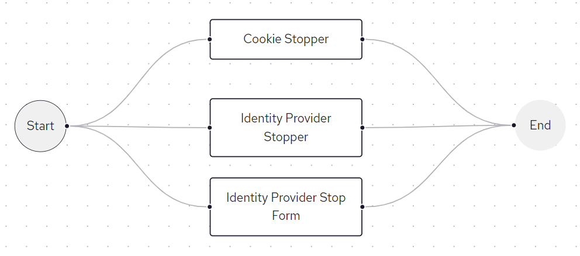

# IDP Restriction Module

The IDP Restriction module allows the Keycloak admin team to control which identity providers (IDPs) are accessible for each application. It was developed because many applications connected to Keycloak are standard, out-of-the-box products with limited customization capabilities. The module also helps the admin team enforce IDP usage, without relying on each application to follow the established processes/rules. The module is a collection of custom Keycloak extensions, originally created by the BC SSO Team and customized for the AM Team's needs.

The core of the module consists of three authenticators: **CookieStopAuthenticator**, **IdentityProviderStopAuthenticator**, and **IdentityProviderStopForm**. These are used in the **Browser Authentication Flow**.



The authenticators are set up as alternatives in the browser flow (see picture above), meaning if one authenticator fails, the flow moves to the next one.

- **CookieStopAuthenticator**: Checks if there is an existing Keycloak session cookie and ensures it is linked to an allowed Identity Provider for the specific client.
- **IdentityProviderStopAuthenticator**: Checks which Identity Providers are allowed for the specific client and redirects to the IDP login page if only one is found.
- **IdentityProviderStopForm**: Checks the allowed Identity Providers for the specific client and dynamically updates the common-logon page to restrict the user's IDP options through the UI.

The authenticators determine which IDPs are allowed based on client scopes created at the realm level. The name of a scope must match the IDP alias (with a “-saml” suffix for SAML-based scopes). These scopes are then assigned to specific clients.

A custom theme **moh_applications_idp_restriction** that inherits from the **moh_applications** theme is also needed. The theme engine uses the idpContext variable, which is provided by the IdentityProviderStopForm authenticator, to display the permitted IDPs.

## Prerequisites

Before building and deploying the Idp Restriction Module, ensure you have the following:

- JDK 17
- Apache Maven (version 3.6.3 or compatible)
- Keycloak (version 22.0.4 or compatible)

## Automated Build

This repository contains a [Build IdpRestrictionModule](https://github.com/bcgov/moh-am-idp-restriction-module/blob/main/.github/workflows/build-idp-restriction-module.yml) GitHub workflow that automates the build process. The workflow is executed when a PR against the `main` branch is opened. It can also be executed manually.
When executing manually developer needs to select a branch/tag from where the workflow will run. The output of the workflow is a zipped file that contains the IdpRestrictionModule.jar file as well as the custom moh_applications_idp_restriction theme. The artifacts generated by the workflow run are stored for one day.

## Build from Source

If you are working on updating this Keycloak extension and wish to build from the source, to test on your local machine, follow these steps:

1. Clone the repository:

   ```bash
   git clone https://github.com/bcgov/moh-am-idp-restriction-module.git
   ```

2. Compile and package the project using Maven:

   ```bash
   mvn clean package
   ```

   This command generates a JAR file located in the `target` directory that contains custom Authenticators.

## Deployment

Deployment consists of two parts - publishing the custom Theme and Service Provider Interface.
Please follow Keycloak's documentation on Service Provider Interfaces (SPIs). At the time of writing, the process involves:

- Generating the JAR, copying it to the `providers` folder of the Keycloak installation
- Copying custom theme to `themes` folder
- Clearing cache and restarting Keycloak.

For detailed commands, please refer to [this RFC document](https://proactionca.ent.cgi.com/confluence/display/BCMOHAM/RFC-20240920-01-BCMOHAD-25401-TEST-KEYCLOAK-Deploy_Idp_Restriction_Module).
For more information regarding clearing Keycloak cache, please refer to [moh-am-themes repository](https://github.com/bcgov/moh-am-themes)

According to the Keycloak documentation, "After registering new providers or dependencies, Keycloak needs to be re-built
with the `kc.[sh|bat] build` command". However, in our deployment environment, simply restarting the service was
sufficient, possibly because the `build` step is included in the systemctl service.

Same principles apply when developing and deploying the Idp Restriction Module locally.

## Usage

After successfull deployment, follow these setps to configure and use the Idp Restriction Module:

- Create a custom browser flow as shown in the picture above. The authenticators should be visible in the admin console as `CookieStopper`, `Identity Provider Stopper` and `Identity Provider Stop Form`.
- Create the client scopes that represent idp aliases. Remember about the -saml suffix for SAML-based clients.
- Assign the created client scopes, the custom theme, and the custom browser flow to the respective clients.

## Release Process

Before deploying to development or test environments, create a draft release. Upload the artifact generated by the [Build IdpRestrictionModule](https://github.com/bcgov/moh-am-idp-restriction-module/blob/main/.github/workflows/build-idp-restriction-module.yml), triggered by a pull request.

For production deployments, manually trigger the workflow that builds the artifacts from the main branch. Ensure that the release is finalized with the appropriate version tag and release notes.

## Resources

- [BC SSO GitHub repository](https://github.com/bcgov/sso-keycloak/tree/dev/docker/keycloak)
- [Keycloak documentation: Service Provider Interfaces](https://www.keycloak.org/docs/22.0.4/server_development/#_providers)
- [Keycloak documentation: Registering provider implementations](https://www.keycloak.org/docs/22.0.5/server_development/index.html#registering-provider-implementations)
- [Keycloak documentation: Deploying Themes](https://www.keycloak.org/docs/22.0.4/server_development/#deploying-themes)
